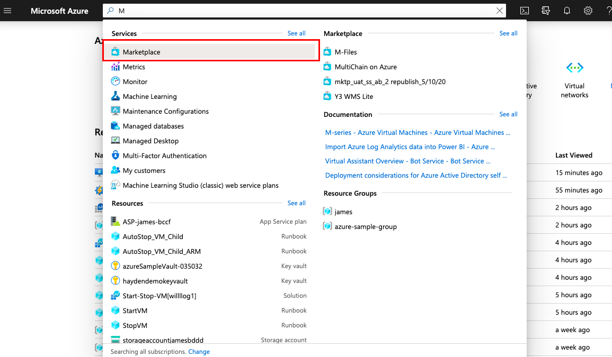
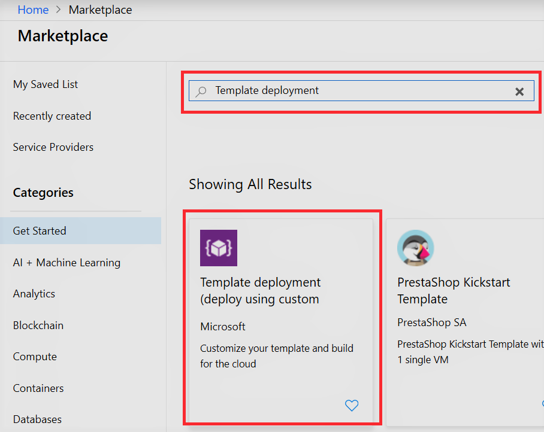
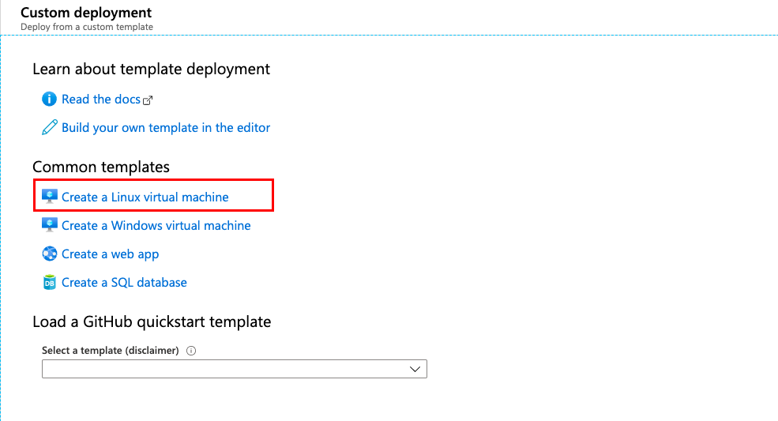
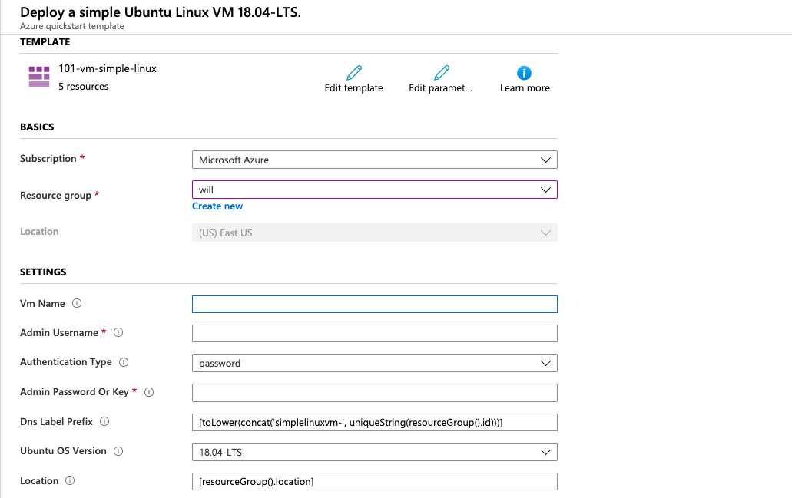
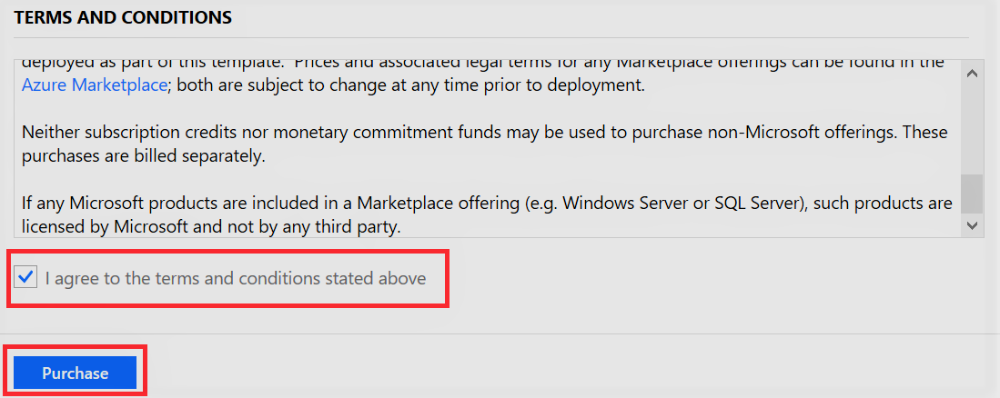
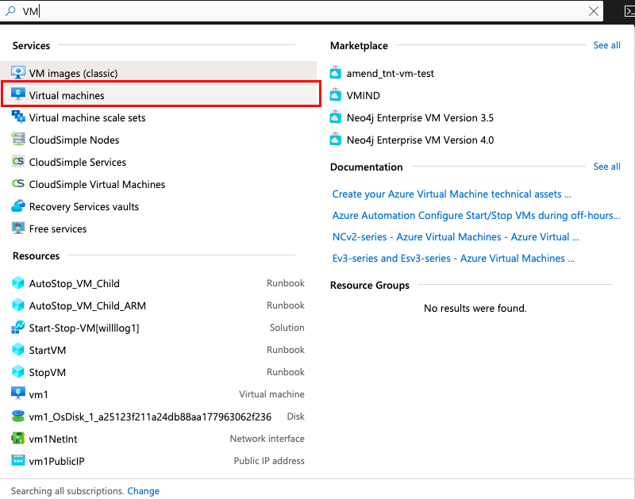
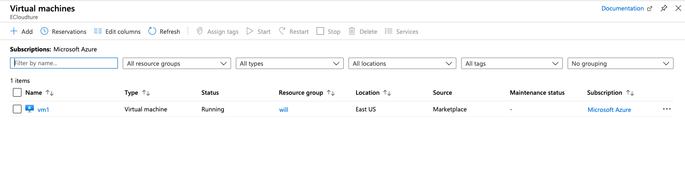

# Deploy VM Resource Manage Template

## Overview

[Azure Resource Manager](https://azure.microsoft.com/en-us/features/resource-manager/) is the deployment and management service for Azure. It provides a consistent management layer that enables you to create, update, and delete resources in your Azure subscription. Resource Manager template is a JSON file that used to define one or more resources to deploy to a Resource Group or Subscription. The template can be used to deploy the resources consistently and repeatedly.

## Scenario

In this lab, we'll deploy  a Linux virtual machine by Resource Manage Template

## Prerequisites

1. The workshop’s region will be in **East US 2**

## Lab

1. In Azure Portal, search **Marketplace**

    

2. Search Template deployment in Marketplace

    

3. Find Template deployment and select **Create**

    

4. Input your informaation
    
    * Subscription : `your Subscription`
    * Resource group : `your resorce group `
    * VM Name : `your_name_VM`
    * Admin Username : `your name`
    * Admin Password Or key : `your password`
    * Tick `I agree to the terms and conditions stated above`

5. Click **Purchase** to complete the deployment

    

    

6. Check Service 

    * In the search Box , Enter **VM**

    

7. Service deployment successful

    

