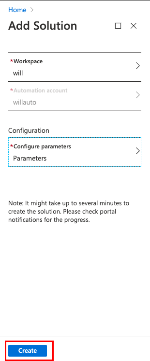
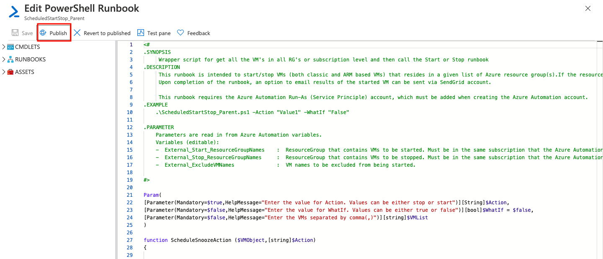

# Azure Automation Start/Stop VMs solution by Runbook

## Overview
[Azure Runbook](https://docs.microsoft.com/en-us/azure/automation/automation-runbook-types)  is the management service for Azure Automation. It enables you to create, update, and edit scripts in your Azure subscription to manage your azure resources with automation. Runbook can be edit with **powershell**, **python** and **graphical** editor in Azure portal. The script can be combined with SendGrid, Azure Alert, Template and other services to accomplish automated management of Azure environment

## Scenario

Add the **Start/Stop VMs** to a new or existing Automation account  After completing the onboarding process,configure the variables to customize the solution

## Prerequisites

1. The  **Automation account** workshop’s region will be in **East US2**
2. The **Log Analytics** workspaces's region will be in **East US**

## Step by Step 

### Create Log Analytics  workspaces

1. Search Log Analytics workspaces on search box

    

2. Click **Add**

    

3. Input users informations

    * Subscription :`Your subscription`
    * Resource group: `Your resource group`
    * Name : `Your Names`
    * Location :`East US`

4. Click **Review+Create**

    

###  Create Automation Account

1. Search **Automation Accounts** on search box 

    

2. Click **Add**

    

3. Enter  users informations

    * Name : `your nanes`
    * Resource group: `your resource group`
    * Location :`East US 2`
    * Create Azure Run As account : `Yes`

4.  For the **Create Azure Run As account** option, ensure that **Yes** is selected, and then click **Create**

    

    

### Enable Azure Automation Start/Stop VMs solution

1.  From the Automation account, select **Start/Stop VM** under Related Resources

    

2. **Clicking Manage the solution**

    

3. Click **Add**

    

4. Search **Start/Stop VMs during off-hours** on the search box 

    

5. Click **Create**

    

6. Configure the solution

* Select **Log Analytics workspace**

    

7. Select Configuration
    * Specify the Target ResourceGroup Names: These values are resource group names that contain VMs to be managed by this solution
    *  Specify the VM Exclude List : one or more virtual machines from the target resource group
    * Select a Schedule: Select a date and time for your schedule

    

8. Click **OK** to close the Parameters page and select **Create**

    

### Test  Runbook

1. From the Automation account, select **Runbook**

    

2. Test Runbbok

    

3. Publish PowerShell Runbook

* Select **ScheduledStartStop_Parent**

* Click **Edit**

    

* Click **Publish**

    

* Click **Yes**

    

6. Start Runbook

* Entern **Action** and **VMname**

    * ACTION: `Stop`
    * WAHTIF: Select `Default will be used `
    * VMLIST: `Your VMname`
* Click **OK**

    

7. The Runbook Test begin and we are able to view the results and the error messages as the code below shows

    

8. View VM status

    

9. Start Runbook

* Entern **Action** and **VMname**

    * ACTION: `Start`
    * WAHTIF: Select `Default will be used `
    * VMLIST: `Your VMname`
* Click **OK**

    

10. The Runbook Test begin and we are able to view the results and the error messages as the code below shows

    

11. View VM status

    

## Conclusion

We learned how to easy schedule Start-Stop Azure Virtual Machine, This is a great way to save money from the Test/Lab Azure Virtual Machines which must be up & running for the development teams. 

