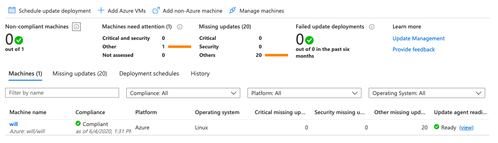

# Enable Update Management on multiple VMs

## Overview
Use [Update Management](https://docs.microsoft.com/en-us/azure/automation/automation-update-management)  in Azure Automation to manage operating system updates for your Windows and Linux machines in Azure, in on-premises environments, and in other cloud environments. You can quickly assess the status of available updates on all agent machines and manage the process of installing required updates for servers

## Scenario

Azure Automation provides solutions to manage operating system security updates, track changes, and inventory what is installed on your computers

## Prerequisites

1. Already create Log analytice workspaces in **East US** location

2. Aleardy create Automation accounts in **East US 2** location

## Step by step 

### Enable solutions

1. Navigate to your Automation account and select **Inventory** under Configuration Management.

    

2. Choose the **Log Analytics workspace** and **Automation account** and click **Enable** to enable the solution

    

### Enable update management solution

1. Navigate to your Automation account and select **Update Management** under Update Management

    

2. Choose the **Log Analytics workspace** and **Automation account** and click Enable to enable the solution

    

### Onboard Azure VMs

 1.Select **Update management** under Update management
 

    

 2. Click **Add Azure VMs**, select one or more VMs from the list

    

3. On the Enable Update Management page, **click Enable**

    

4. Select **Manage machines**

    

* Select **All available machines** and click **Enable**

    

### View computers attached to Automation account

After you enable Update Management for your machines, you can view machine information by selecting Computers

list of possible values for compliance state: 

* `Compliant`: Computers that are not missing critical or security update

* `Non-compliant`: Computers that are missing at least one critical or security update

* `Not assessed`: The update assessment data hasn't been received from the computer within the expected timeframe

    

### Schedule an update deployment

 To schedule a new update deployment for one or more virtual machines

1. Under Update management, select **Schedule update deployment**

    

2. In the New update deployment pane, specify the following information:

    

* `Name`: Enter your unique name  

* `Operating system`: Select **Linux**

* `Groups to update` : Select your resource , and click **Add** and **OK**

    

* `Machine to update` : Choose **Machines**, the readiness of the machine is shown in the Update agent readiness column,Click **OK**

    

* `Schedule settings`: Accept the default date and time, which is **30** minutes after the current time

* `Recurrence`: Select Recurring

    * `Recur`: **1 Day**
    * Click **OK**

    

* Click **Create**

    

### View results of an update deployment

After the scheduled deployment starts, you can see the status for that deployment on the Update deployments tab under Update management

    

1. If the deployment is currently running, its status is In progress. After the deployment finishes successfully, the status changes to **Succeeded**

    

2.  Click **Name** and view for result detail 

    

3. Form your Automation account ,under Process Automation, Select **Job**

    

4. Click runbook job

    

5. Click **All Logs**, view patch update log

    

## Conclusion

1. Assess compliance of virtual machines in Azure

2. Patch updates on both Windows and Linux VMs

3. Schedule reoccurring patching

